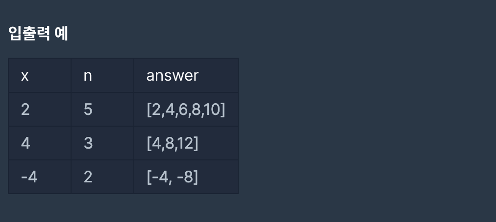

# 알고리즘 문제 제목




이 문제는 횟수 n번까지 자연수 x의 간격만큼 계속 더한 수를 배열로 만들어 반환하는 문제입니다. 제한조건에 나와있는 -n 이상 n 이하의 정수라고 되있지만 레벨1단계에 자주 등장하는 조건이며 크게 신경 쓸 필요가 없다고 생각합니다.

---

## 내가놓은 답

```js
function solution(x, n) {
  var answer = [];
  for (let i = 1; i <= n; i++) {
    answer.push(x * i);
  }
  return answer;
}
```

저는 `for`문으로 간단하게 구현했습니다. 보이는 그대로이기 때문에 더 설명할 말이 없습니다.

그런데 이 문제도 다른 기가막힌 예시가 있습니다.

---

## 다른사람들 풀이

```js
function solution(x, n) {
  return Array(n)
    .fill(x)
    .map((v, i) => (i + 1) * v);
}
```

`Array()` 입니다. 이는 배열을 초기화할때 사용합니다. 저는 항상 `new`키워드를 붙이는게 국룰이라고 생각하긴 하는데, 그냥 `Array()`만 써도 되는군요.

## 오늘의 메소드 및 생성자

`new Array()`

이 메소드는 배열을 초기화할때, 새로운 배열을 생성할때 사용합니다.
보통 배열을 생성할땐 `[]`을 씁니다만, `new Array()`은 약간 차이가 존재합니다.

`new Array()` 생성자는

```js
let 하나 = new Array(); // []

let 둘 = new Array(5); //[empty x 5]
둘.length; // 5
둘[0]; // undefined
```

빈 배열을 특정 요소로 통일할 목적이라면 이 방법도 사용해 볼 수 있습니다.
그것은 바로 `fill`이라는 `Array.prototype`으로 이어진 `fill`메소드입니다.

```js
new Array(n).fill(1); //  [1,1,1,1,1, n만큼]
new Array(4).fill(1); // [1,1,1,1]

new Array(5).fill(2, 3); //2를 3번인덱스부터. [empty x3 , 2, 2]
```
