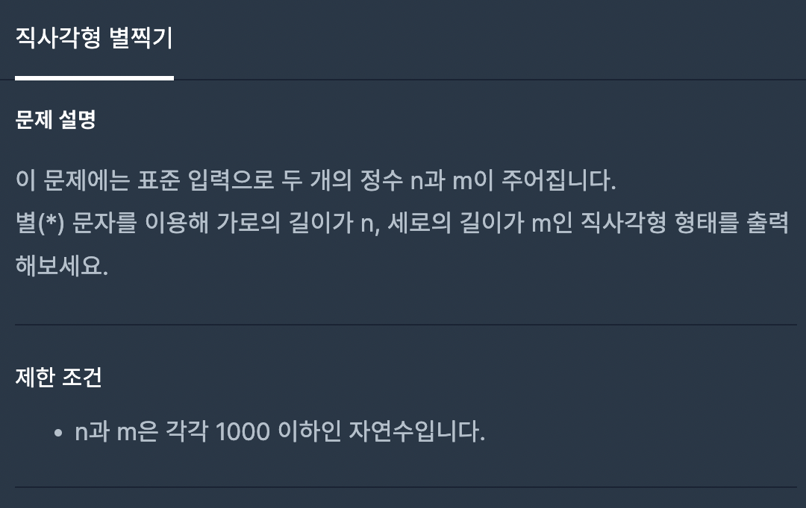
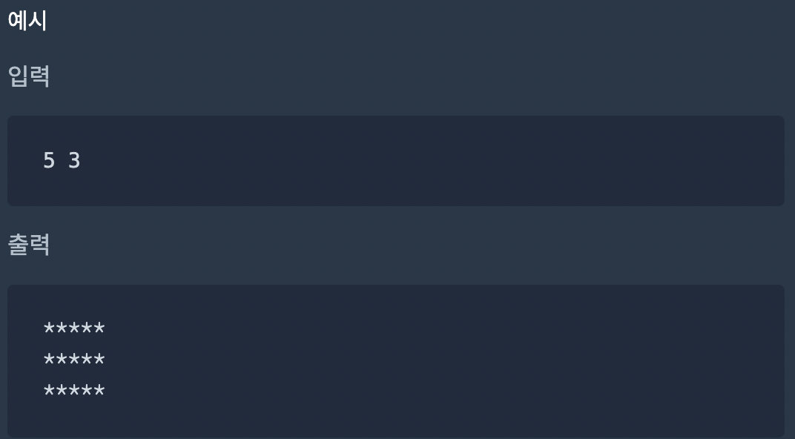

# 직사각형 별찍기




이 문제는 `*`을 담은 문자열을 반환 하는 것이 아닌 출력하는 문제입니다. `data` 보시면 n은 string 타입의 배열을 담고 있습니다. a와 b는 첫번째 요소, 두번째 요소를 할당 받았습니다.

이것을 어떻게 `출력`할지 답을 찾아가는 기초중의 기초 문제입니다.

## 내가놓은 답

```js
process.stdin.setEncoding('utf8');
process.stdin.on('data', (data) => {
  const n = data.split(' ');
  const a = Number(n[0]),
    b = Number(n[1]);
  // console.log(a);
  // console.log(b); //얘들을 같이 포함시키면 오답으로 나옵니다. 주석처리
  // console.log(n)

  // type = 문자열 초기화
  let star = '';

  // 간단히 2중포문으로 해결
  for (let i = 0; i < b; i++) {
    // 0부터 2까지(0, 1, 2, Horizen)
    for (let j = 0; j < a; j++) {
      // 0부터 5까지(0, 1, ,2,3, 4, 5 , Vertical)
      // a길이 까지 별을 더함
      star += '*'; // star += '*'은 str = star + * 을의미합니다.
    }
    // a까지 도달하면 줄바꿈
    star += '\n'; // j가 a까지 수행하면 b는 +1로 다음 a가 수행될 때까지 반복합니다.
  }
  console.log(star); //return쓰면 통과가 안됩니다.
});
```

## 다른사람들 풀이

```js
process.stdin.setEncoding('utf8');
process.stdin.on('data', (data) => {
  const n = data.split(' ');
  const a = Number(n[0]),
    b = Number(n[1]);
  const row = '*'.repeat(a); //한줄에 a개씩 *을 저장
  for (let i = 0; i < b; i++) {
    console.log(row); // vertical b까지 반복
  }
});
```

여기선 `repeat`이라는 `String`의 `Prototype`으로 이어진 함수, 즉 메소드를 사용해줬습니다.

## 오늘의 메소드 및 생성자

`string.repeat(count);`

`String.prototype`으로 이어진 메소드 `repeat(n)`입니다. 얘는 문자열을 4번 반복해서 다시 붙입니다.
```js
let str = 'a' 

str.repeat(4);  //aaaa
```